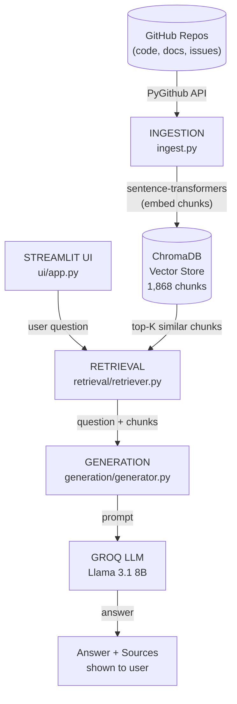
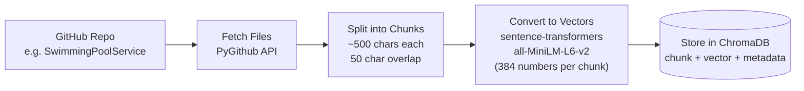
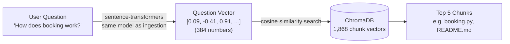
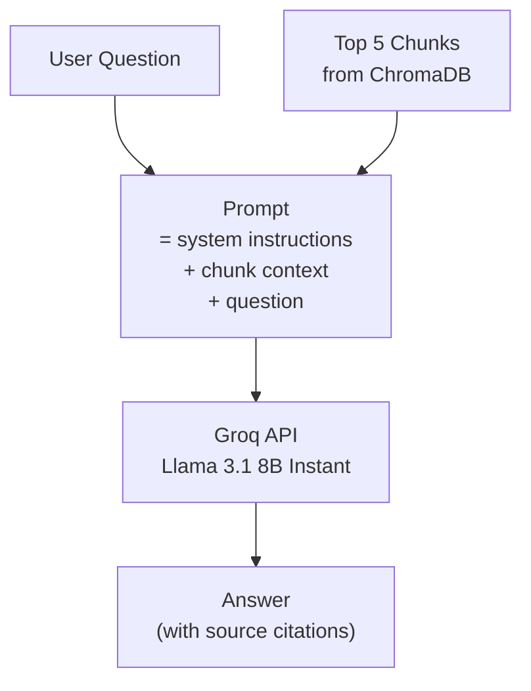
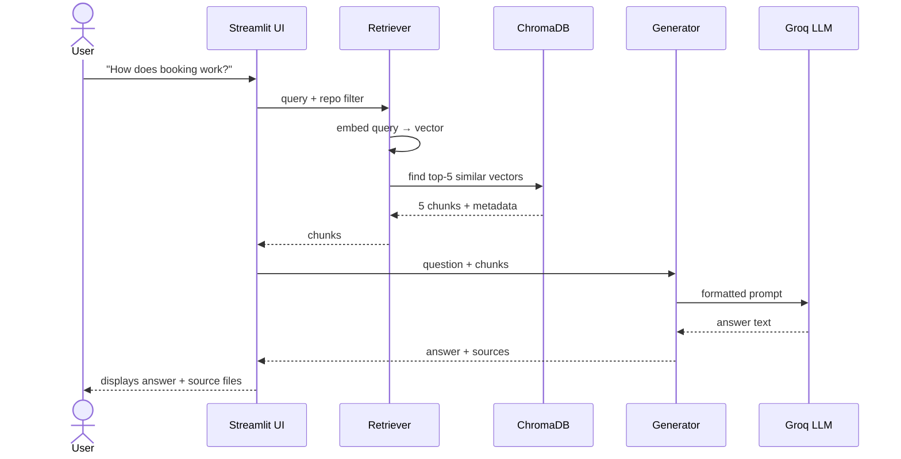

# System Design — RAG Codebase Agent

---

## High-Level Architecture



---

## Phase 1 — Ingestion (Run Once)

**What happens:** Your GitHub repo is downloaded, split into small pieces, converted to numbers (vectors), and stored locally.



**Simple example:**

| Step | Example |
|---|---|
| Raw file | `def book_cleaning(date, pool_size): ...` (2,000 chars) |
| After chunking | 4 chunks of ~500 chars with 50-char overlaps |
| After embedding | Each chunk → `[0.12, -0.45, 0.88, ...]` (384 numbers) |
| Stored in ChromaDB | chunk text + vector + `{repo: "SwimmingPool", source: "booking.py"}` |

---

## Phase 2 — Retrieval (Every Query)

**What happens:** Your question is converted to a vector, then ChromaDB finds the chunks whose vectors are most similar (nearest neighbours).



**Why this works (simple analogy):**
> Similar *meaning* → similar *numbers* → close together in vector space.
> "How do I book?" finds `booking.py` even if the word "book" doesn't appear — because the *meaning* is close.

---

## Phase 3 — Generation (Every Query)

**What happens:** The retrieved chunks + your question are sent to an LLM as a prompt. The LLM reads them and writes a human answer.



**Prompt structure:**

```
You are a helpful assistant that answers questions about a codebase.
Use only the context provided. Always cite the source file.

[1] Source: SwimmingPoolService / booking.py
def book_cleaning(date, pool_size):
    ...

[2] Source: SwimmingPoolService / README.md
To book a cleaning, call the /book endpoint...

Question: How does booking work?
```

---

## Technology Choices

| Component | Technology | Why |
|---|---|---|
| **Vector store** | ChromaDB | Runs locally, no server, no API key, free |
| **Embedding model** | `sentence-transformers/all-MiniLM-L6-v2` | Free, runs on CPU, fast, no API key |
| **LLM** | Groq → Llama 3.1 8B | Free tier (14,400 req/day), no credit card |
| **GitHub access** | PyGithub | Official API wrapper, handles pagination |
| **Orchestration** | LangChain | Standard RAG framework, swappable components |
| **UI** | Streamlit | Zero frontend code, Python only |
| **Deployment** | Streamlit Community Cloud | Free, zero-config for Streamlit apps |

---

## Data Flow Summary



---

## What's Indexed vs Not Indexed

```
✅ Indexed (can answer questions about)        ❌ Not indexed
─────────────────────────────────────         ──────────────────────
• .py, .js, .ts, .md, .html, .css files       • GitHub Issues
• README and documentation                     • Pull Requests
• Config files                                 • Code comments in PRs
• All 5 repos (1,868 chunks total)             • Live/runtime data
```
